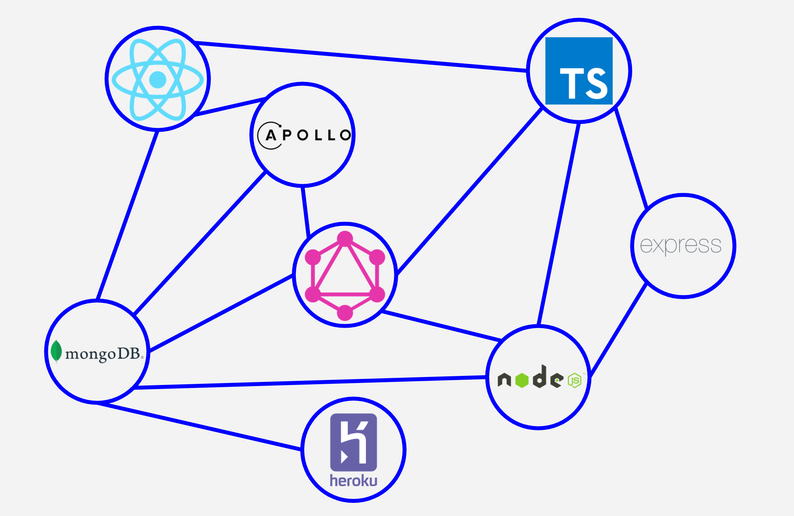
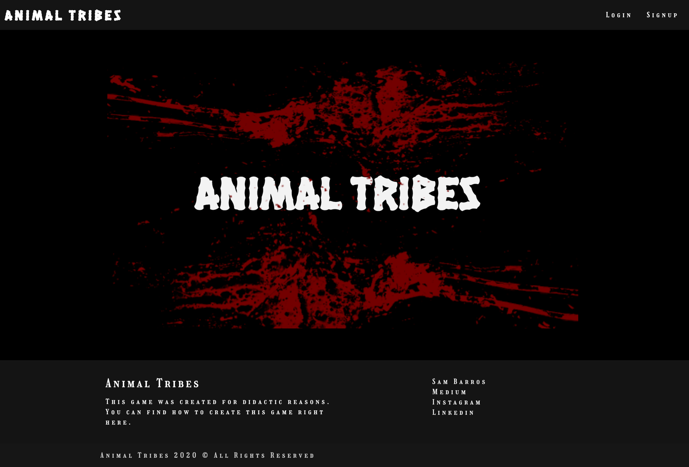

# animal-tribes-server

Animal Tribes - Server

# Introduction

This repository is the result of the tutorial **Animal Tribes: How to create your first full-stack Typescript GraphQL Application?** and you can find it [here](https://medium.com/@samarony.barros/how-to-create-your-first-mern-mongodb-express-js-react-js-and-node-js-stack-7e8b20463e66)

## What is ANimal Tribes

Animal tribes is a game created to teach you a full tutorial in how to build your first full-stack application using Typescript, Node, React and GraphQL.



This is the second part where you can learn how to build the server.



## Download

You can download the folder on my [GitHub](https://github.com/samaronybarros/) or you can do this directly on [this link](https://github.com/samaronybarros/animal-tribes-server).

If you have git installed on your PC, you just need do as follow:

```
$ git clone https://github.com/samaronybarros/animal-tribes-server.git
```

## Configuring App

```
$ cd animal-tribes-server
$ yarn install
$ yarn start
```
